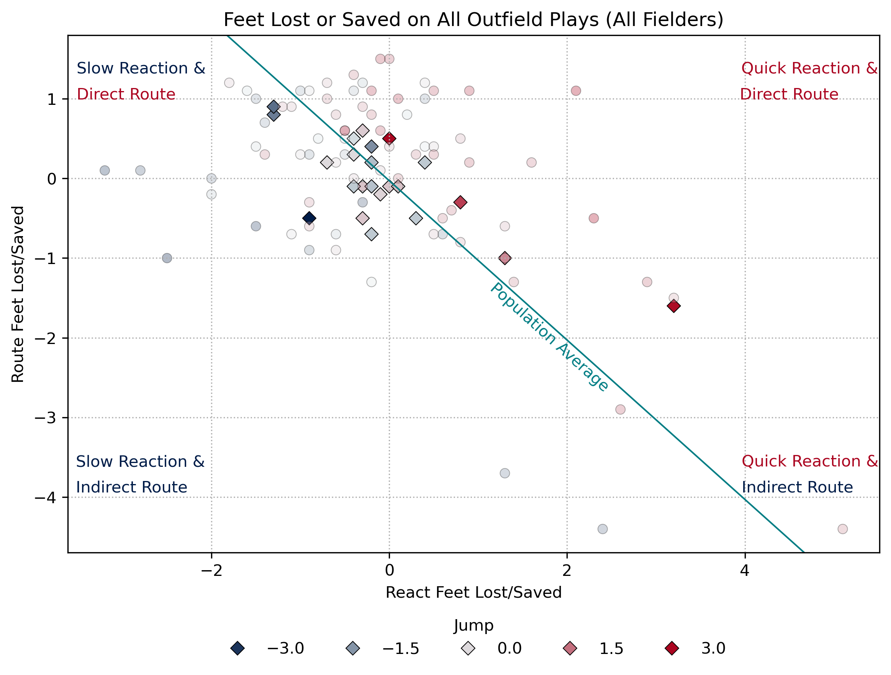

# Data Analyst

#### Languages: Python, R, SQL
---
## About Me
I’m a new graduate from the University of Arizona, where I completed a Bachelor of Applied Science in Applied Computing with an emphasis in Applied Artificial Intelligence. Additionally, I completed an undergraduate certificate in Data Science and Visualization. My coursework has highlighted my skills in creating scripts using Python and R programming languages, enabling me to load, manipulate, transform, analyze, and visualize data. During my undergraduate career, I consistently earned recognition for academic excellence, including placement on the Dean’s List with Distinction (2023–2025), the Distinguished Undergraduate Scholar award (Fall 2025), and the Fall 2025 Merit Award, which honors graduating students who have overcome significant challenges in their academic journey.

Through my courses, I have gained hands-on experience in training machine learning models, running statistical tests, and applying data mining techniques. These include Naive Bayes, k-Nearest Neighbors, linear and logistic regression, k-means clustering, binary trees, random forests, t-test, and ANOVA.

In addition to my technical skills, I bring over 10 years of customer service experience, predominantly in lead and management roles. This background has instilled in me the importance of effective communication and teamwork. My ability to connect with people, resolve conflicts, and manage teams has been instrumental in my professional growth and success.

---

## Projects
**[Go Ahead and Jump: Early and Often | 2025 SMT Data Challenge](https://github.com/EScotCarpenter/go-ahead-and-jump-analysis-of-outfielder-metrics)**

**SQL \| Python \| Data Engineering \| Machine Learning \| Data Visualization**

This project is my submission to the 2025 SMT Data Challenge where I leveraged Python and SQL with Minor League player and ball-tracking data to analyze metrics of outfielder’s routes, calculate Outs Above Average (OAA), recreate Statcast's Jump metric, and introduce Route Intensity which is the percentage of the outfielder’s route that an outfielder exerts high intensity by traveling at or near their max sprint speed.

 | 

**[Washington State Health Outcome Rankings](https://github.com/EScotCarpenter/washington-state-health-outcomes)**

**Python \| Hypothesis Testing \| Machine Learning \| OOP**

Constructed in Jupyter Notebook and executed in Python, this project analyzed Health Outcome Rankings for all counties in Washington state from 2015 to 2023. It involved statistical hypothesis testing, building linear regression models to predict county health rankings, and constructing logistic regression models to determine feature weights for top rankings. Models were evaluated using random sampling cross-validation and visualized through ROC curves.

 |  

**[Worth a Shot: NBA Shot Analysis](https://github.com/EScotCarpenter/worth-a-shot-NBA-shot-analysis)**

**R \| Tidyverse \| Hypothesis Testing \| Simulation \| EDA \| Data Visualization**

Constructed and executed in R markdown, this project analyzed NBA shot data from 2003-2024, focusing on changes in shot selection. Using tidyverse and dplyr pipelines, dataframes were organized and summarized. Exploratory data analysis uncovered trends in scoring and field goal percentages by orientation and range. Expected values explained offensive shifts, and binomial simulations constructed samples for statistical tests.

 |  

**[Untwisting the Storm: Tornado Analysis](https://github.com/EScotCarpenter/untwisting-the-storm-tornado-analysis)**

**R \| ANOVA \| EDA \| Data Visualization**

Constructed and executed in R Quarto, this project analyzed tornado metrics, focusing on changes in reporting frequency, time, and location. Exploratory data analysis revealed an increased frequency of tornadoes, particularly within the EF0 category. An ANOVA test comparing different eras of tornado reporting found statistically significant results. A choropleth map visualized the varying frequencies of tornado reports.

---
## Education
  
  | B.A.S., Applied Computing Emphasis on Applied AI | University of Arizona 2025

  | Certificate, Data Science and Visualization | University of Arizona 2025

